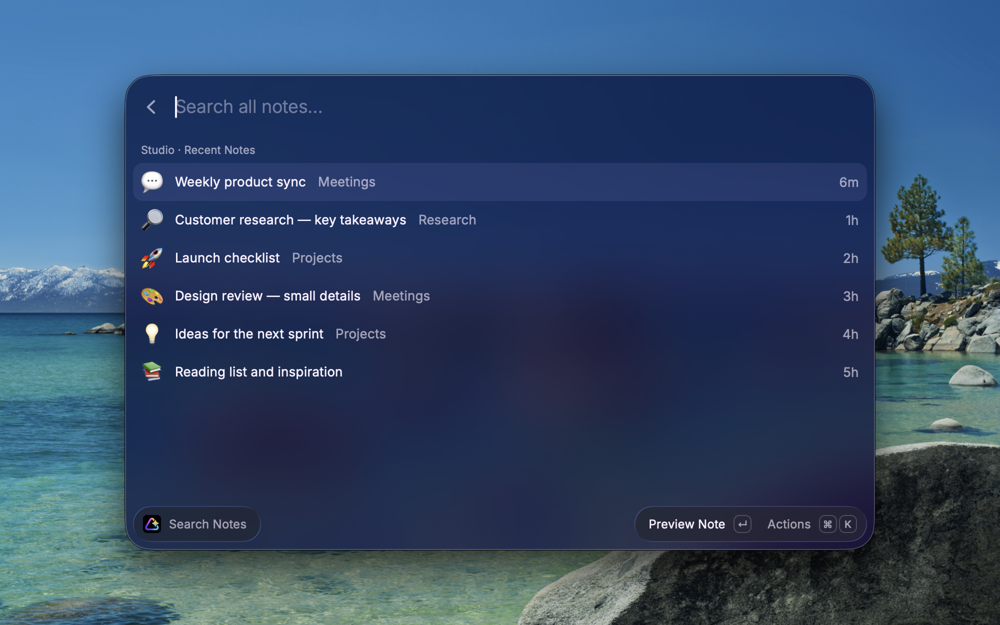

# Prismical for Raycast

Search, read, and capture notes in your Prismical Cloud workspace without leaving your keyboard.

**Experimental desktop support:** recording shortcuts require a compatible Prismical desktop build and are not available in every release.

[Prismical website](https://prismical.ai) · [Prismical on GitHub](https://github.com/amicalhq/prismical)

## What you can do

- **Search Notes** — browse recent notes with emoji icons, search your workspace, preview notes, and read meeting transcripts. Open notes in Prismical or copy their content and links.
- **Create Note** — write a note, choose a folder, or capture text from your clipboard or selection.
- **Append to Note** — add text to an existing note without replacing its content.

- **Start Recording in New Note** — open a new floating note and request a recording in Prismical desktop.
- **Stop Recording** — stop the active desktop recording.
- **Open Floating Note** — open Prismical’s floating note.

Set aliases and keyboard shortcuts for these commands in Raycast Settings.

## Get started

You’ll need macOS, Raycast, and a Prismical Cloud workspace with API access.

1. Sign in to [Prismical](https://app.prismical.ai).
2. Open **Settings → API & MCP** and create an API key for your workspace.
3. Open a Prismical command in Raycast and enter the key in **Prismical API Key**.

The default server settings connect to Prismical Cloud. To switch workspaces, replace it in the extension’s preferences. You can revoke the key in Prismical at any time.

Search, Create Note, and Append to Note work with cloud notes and require an API key. They cannot access notes stored only on your device.

Desktop shortcuts use the desktop app’s active workspace, which may differ from your cloud API key’s workspace, and do not require an API key. Complete recording setup and permissions in Prismical first. After starting, check the recording indicator in the app.

## Privacy and saved drafts

Your API key is stored in Raycast’s password preferences. Requests go directly to Prismical, and the extension adds no analytics. Clipboard and selected text are read only when you choose those actions.

If a save is interrupted, the extension keeps recovery text locally. Follow the prompt to check whether the note saved before retrying. **Discard Saved Recovery** removes the local recovery text without deleting your note in Prismical.

Raycast preserves unsent text in the standalone **Create Note** command. When creating or appending from within another command, unsent text is not retained after leaving the form.
